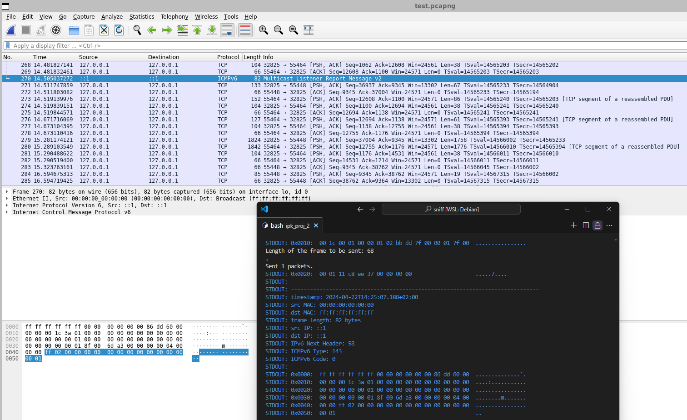

# Project ZETA: Network Sniffer

## Overview
Project ZETA is a network analyzer designed to capture and filter packets on specified network interfaces. It utilizes the *PCAP library to interface with network devices in promiscuous mode, enabling the inspection of all traffic visible on the network device.

## Executive Summary of Theory

A network sniffer, or packet analyzer, is an essential tool for capturing and analyzing packets that traverse a network interface in real time. Understanding the theoretical underpinnings of a network sniffer is crucial for utilizing its full potential. Key concepts relevant to this implementation include:

### Networking Basics
- **Packets and Frames**: Fundamental units of data in networks. Packets encapsulate data for network transmission, adhering to specific protocols like TCP, UDP, or ICMP.
- **Network Interfaces**: Points of interaction between a computer and a network. In promiscuous mode, a network interface captures all traffic passing through it, not just traffic addressed to it.

### Data Link and Network Layer Protocols
- **Ethernet**: The most common data link layer protocol, used to frame packets for transmission over physical mediums.
- **IP (Internet Protocol)**: Facilitates routing by adding addressing information to the data packet, enabling network layer functioning.
- **ARP and NDP**: Protocols used for resolving network layer addresses into link layer addresses within local area networks.

### Transport Layer Protocols
- **TCP and UDP**: Key protocols at the transport layer, where TCP provides reliable, ordered delivery of a data stream, and UDP allows simpler, connection-less communication.

### Packet Filtering and Analysis
- **Libpcap**: A widely used library that provides a high-level interface to network packet capture systems. Libpcap allows for the capture of packets in various formats, filtering them according to specified rules, and analyzing them for different purposes.
- **Filtering by Ports and Protocols**: Essential for narrowing down data capture to relevant information, such as specific source or destination ports, or protocol types like TCP, UDP, ARP, and ICMP.

### Advanced Networking Features
- **IPv4 and IPv6 Support**: Handling different internet protocol versions ensures comprehensive monitoring capabilities across diverse network environments.
- **Handling Special Headers and Extensions**: Supports the interpretation of IPv4 options, IPv6 extension headers, and different link-types.
- **Multicast Listener Discovery (MLD)**: Handles MLD packets, a subset of ICMPv6 used for managing IPv6 multicast listeners, thereby enhancing the sniffer’s utility in IPv6 multicast network environments.

Understanding these concepts is pivotal for deploying and leveraging a network sniffer effectively. This knowledge aids in comprehending how data travels across a network and how it can be intercepted and analyzed to diagnose issues, monitor performance, and ensure security.


## Features
- **Packet Capture**: Captures live packet data from a specified interface.
- **Filtering**: Allows filtering of packets based on TCP/UDP ports, and by various protocols including ARP, NDP, ICMPv4, and ICMPv6.
- **Interface Listing**: Displays a list of active network interfaces when no interface is specified.
- **Control**: Can be terminated using the Ctrl + C command.

## Usage
Execute the sniffer with the following command syntax:
```bash
./ipk-sniffer [options]
```
### Options:
- `-i, --interface`: Specify the network interface (e.g., `eth0`).
- `--port-source`, `--port-destination`: Filter by source or destination port.
- `--tcp`, `--udp`: Capture specific TCP or UDP packets.
- `--arp`, `--ndp`, `--icmp4`, `--icmp6`, `--igmp`, `--mld`: Capture specific protocol packets.
- `-n`: Specify the number of packets to capture before terminating.

### Example Commands
- Capture two TCP packets on interface `eth0` with destination or source port 23:
```bash
./ipk-sniffer -i eth0 -p 23 --tcp -n 2
```
- List available interfaces:
```bash
./ipk-sniffer -i
```
## Key Functions Description

### `main.c`
- **`main()`**: Entry point of the application, handles command line arguments and initializes the sniffer based on user inputs.
- **`print_interfaces()`**: Lists all available network interfaces on the system when no specific interface is provided.
- **`usage()`**: Prints the usage information of the program, guiding the user on how to run the application with appropriate flags.

### `sniffer.c`
- **`initialize_sniffer()`**: Sets up the sniffer on a specified interface with given filters, opening the session in promiscuous mode.
- **`start_packet_capturing()`**: Starts the packet capture process, handling the packets with a callback function until the specified number of packets is captured or an interruption occurs.
- **`packet_handler()`**: Callback function that processes each captured packet, extracting essential data and performing protocol-specific parsing.
- **`construct_filter_expression()`**: Constructs a filter expression based on the user's command line options to filter network traffic effectively.
- **`set_filter()`**: Applies the constructed filter expression to the pcap session.

### `utils.c`
- **`set_pcap_handle()`**: Stores the pcap handle needed for clean termination of the program.
- **`sigint_handler()`**: Signal handler for SIGINT (Ctrl+C) that gracefully shuts down the pcap capture and closes the application.
- **`initialize_signal_handler()`**: Sets up the signal handler to ensure the application handles interrupts properly.

### `parser.c`
- **`parse_packet()`**: Main function for parsing the layers of each packet, depending on the type (Ethernet, ARP, IP, etc.).
- **`parse_ethernet_header()`**: Parses Ethernet headers to extract source and destination MAC addresses and determine the payload type.
- **`parse_arp_header()`**: Parses ARP packets to extract and print relevant ARP data such as sender and target IP and MAC addresses.
- **`parse_ip_header()`**: Parses IP headers to handle different types of IP packets and route to specific protocol parsers like TCP or UDP.
- **`parse_tcp_header()`, `parse_udp_header()`**: Extract details from TCP and UDP headers, respectively, such as source and destination ports.
- **`print_packet_data()`**: Prints the raw packet data in a structured hexadecimal and ASCII format for analysis.

This overview provides a concise description of the core functionalities within each source file, aiding in understanding the program's structure and workflow.

## Output
The output includes detailed packet information:
- **Timestamp** (RFC 3339 format)
- **Source/Destination MAC and IP addresses**
- **Frame length**
- **Protocol-specific information**, such as ports for TCP/UDP

Non-printable characters in packet data are represented by a period (`.`).

## Error Behavior

### Argument Behavior
This implementation of the network sniffer exhibits different outputs in response to various argument errors:

- **Using Non-Existing Arguments**: If a user attempts to use non-existing arguments, the program will display usage instructions.
- **--port-source and --port-destination**: If both arguments are used simultaneously, the program will consider `port_src` and `port_dst` as inclusive.
- **(--port-source or --port-destination) AND -p**: If these arguments are used together, the program will overwrite `port_src` and `port_dst` based on the order of the arguments.
- **(-p -30)**: If a negative port number is used, it will be stored in the program but not applied (thus, no port filter will be used).
- **(-p 0)**: The program supports filtering by port 0. This is why ports are initialized as negative numbers.
- **Using Incorrect Data in Arguments**: If a user enters incorrect data for arguments (such as port numbers greater than 65535 or non-existing interfaces), the program will return an error message.

## Interesting Source Code Sections

### `struct option long_options[]` in `main.c`
This array is critical for parsing command-line arguments in the network sniffer application. It defines the options that users can specify when running the program, such as selecting the network interface, specifying source and destination ports, and choosing which protocols to capture. This structured approach allows the program to handle user inputs more efficiently and map them directly to the sniffer's functionalities.
```c
struct option long_options[] = {
    {"interface", required_argument, NULL, 'i'},
    {"port-source", required_argument, NULL, 's'},
    {"port-destination", required_argument, NULL, 'd'},
    // Additional options truncated for brevity
    {0, 0, 0, 0} // Terminating entry
};
```

### `add_condition(const char* condition)` in `sniffer.c`
The `add_condition` function is a clever piece of logic designed to dynamically build the packet filtering expression used by the pcap library. It simplifies the construction of complex filter strings by appending conditions based on user-specified criteria for capturing network traffic. This function optimizes the process by adding logical "or" only when necessary, ensuring the filter expression remains clear and efficient.
```c
void add_condition(const char* condition) {
    if (!first_condition) {
        offset += snprintf(filter_exp + offset, max_len - offset, " or ");
    }
    offset += snprintf(filter_exp + offset, max_len - offset, "(%s)", condition);
    first_condition = 0;
}
```

### `mac_to_str(const unsigned char *mac, char *str, size_t size)` in `parser.c`
This utility function converts a MAC address from its raw binary form into a human-readable string format. It is essential for displaying MAC addresses in logs or user interfaces, where readability is crucial. The function uses the `snprintf` function to format the MAC address correctly, ensuring that the output string is safe from buffer overflow and properly null-terminated. This function was implemented mainly to prevent SIGSEGV errors.
```c
void mac_to_str(const unsigned char *mac, char *str, size_t size) {
    if (mac == NULL || str == NULL) return;
    snprintf(str, size, "%02x:%02x:%02x:%02x:%02x:%02x",
             mac[0], mac[1], mac[2], mac[3], mac[4], mac[5]);
}
```
These functions highlight the application's robustness in handling network data, optimizing performance, and enhancing user interaction.


## Testing

### Overview
Testing of Project ZETA was conducted to ensure its functionality and robustness in various scenarios. The goal was to confirm the accurate capture and filtering of packets under different network conditions and configurations.

### What was tested
- **Functionality**: Basic functionality including packet capturing, filtering by port, protocol, and combination of flags.
- **Edge Cases**: Response to unexpected input and stress conditions such as high network traffic and invalid commands.
- **Comparison with Wireshark**: Functionality and performance compared to a well-known network sniffer, Wireshark, to evaluate efficiency and accuracy.

### Detailed List of Automated Tests

The following specific tests have been implemented in the `ipkSnifferTests.py` script to ensure comprehensive coverage of the network sniffer's functionalities:

- **testUdp**: Verifies that the sniffer can correctly capture and filter UDP packets based on specific port settings.
- **testNdp**: Tests the sniffer's ability to handle NDP packets, ensuring correct capture and display of source IP and frame length.
- **testNdp2**: Similar to `testNdp`, but with a focus on capturing router solicitation messages.
- **testArp**: Checks the sniffer's capability to capture and correctly parse ARP requests, including the extraction of source MAC addresses and frame length.
- **testPrtSrc**: Tests program's reaction on using --port-source and --port-destination at the same time
- **testIcmpv6**: Confirms that the sniffer can capture and parse ICMPv6 echo requests, ensuring accurate IP and frame length reporting.
- **testIcmpv62**: A variant of the ICMPv6 test that possibly involves different ICMPv6 messages.
- **testNdpMdl**: Tests the sniffer's ability to simultaneously handle NDP and MLD packets, verifying correct packet capture and content parsing.
- **testMaxP**: Challenges the sniffer's port filtering capabilities at the upper boundary by using the maximum port number (65535).
- **testMinP**: Tests the sniffer's response to a minimum port number (0), ensuring that edge cases in port filtering are handled correctly.
- **testHigh**: This stress test evaluates the sniffer's performance under a high load of packets to ensure it can handle substantial traffic without missing packets.
- **testAll**: Evaluates the sniffer’s capability to capture and display all supported protocols simultaneously, ensuring comprehensive functionality under mixed traffic conditions.
- **testMld**: Specifically focuses on the sniffer's ability to capture and parse MLD (Multicast Listener Discovery) packets, important for IPv6 multicast network management.

These tests are crucial for ensuring that every aspect of the sniffer is working correctly, from basic functionality to handling edge cases and stress conditions. Detailed results from these tests can be reviewed in `logs/test_log.txt`, providing a comprehensive record of each test scenario and outcome.

### Why it was tested
- To ensure that the application performs as expected under normal and extreme conditions.
- To verify that the application can handle a variety of network protocols and filters effectively.
- To identify and rectify any discrepancies or issues when compared with established tools like Wireshark.

### How it was tested
Tests were conducted using a series of automated and manual test scripts:
- **Automated Tests**: Scripts designed to run the sniffer in various configurations and to analyze outputs against expected results.
- **Manual Testing**: Interactive sessions to explore the user interface and real-time capabilities of the sniffer under live network conditions.

### Testing Environment
- **Software**: Operating on WSL Debian GNU/Linux 11 (bullseye) with Python 3.9.2. For coding and debuging purposes Visual Studio Code was used.
- **Network Setup**: Local area network with simulated traffic including TCP, UDP, ICMP packets.

### Test Results
Logs of the tests can be found in `logs/test_log.txt`, which includes detailed outcomes of each test scenario including the inputs used, expected outcomes, and the actual results observed. Additionally, you can view the results of the `testAll` and examine network traffic using Wireshark in `logs/test.pcapng`. Please note that this file also contains extraneous TCP traffic that may not be relevant to the specific tests.
Here is an image of comparison of Wireshark and my program results:
<br>
<br>
<br>
<br>


<br>

### Critical Observations
- **Performance**: The sniffer for sure handles 100 different packets on a high rate. The sniffer is able to construct various types of filters and catch nessecary si.

This testing approach not only verified the functionality and performance of the sniffer but also highlighted its robustness in handling typical and atypical scenarios encountered in network traffic analysis.

## Hardware Summary

This documentation outlines the key hardware specifications of the system used to develop and test the network sniffer application. Here are the essential details:

- **OS Name and Version**: Microsoft Windows 11 Pro, Version 10.0.22631
- **System Type**: x64-based PC, 
- **Processor**: AMD64 Family 23 Model 8 Stepping 2 AuthenticAMD ~3700 Mhz
- **Total Physical Memory**: 32,704 MB
- **Virtual Memory**: Max Size 34,752 MB

### Networking Details
- **Primary Network Interface (Realtek PCIe GbE Family Controller)**:
  - **Connection Name**: Ethernet
  - **DHCP Enabled**: Yes
  - **IP Addresses**:
    - IPv4: 192.168.0.109
    - IPv6: fe80::ceac:78e:85fb:bcca


## Important References
- [TCPDUMP/LIBPCAP Public Repository](http://www.tcpdump.org/)
- [RFC 5952](https://tools.ietf.org/html/rfc5952) - A Recommendation for IPv6 Address Text Representation
- [RFC 792](https://tools.ietf.org/html/rfc792) - Internet Control Message Protocol a RFC 4443 - ICMPv6
- [RFC 826](https://tools.ietf.org/html/rfc826) - ARP
- [RFC 3339](https://tools.ietf.org/html/rfc3339) - Date and Time on the Internet: Timestamps
- [Wikipedia PCAP](http://en.wikipedia.org/wiki/Pcap)
- [Tests](https://git.fit.vutbr.cz/xstepa77/IPK_PROJ2_TEST/src/branch/main) - Tests for this project
- [Source Tests](https://git.fit.vutbr.cz/xjerab28/IPK-Sniffer-Tests) - Source code for tests upwards

## Alert

While I writing this project I didnt use GIT to upload my files at all. So as commits I pushed some of compilable versions of the project that were implemented during workflow. 